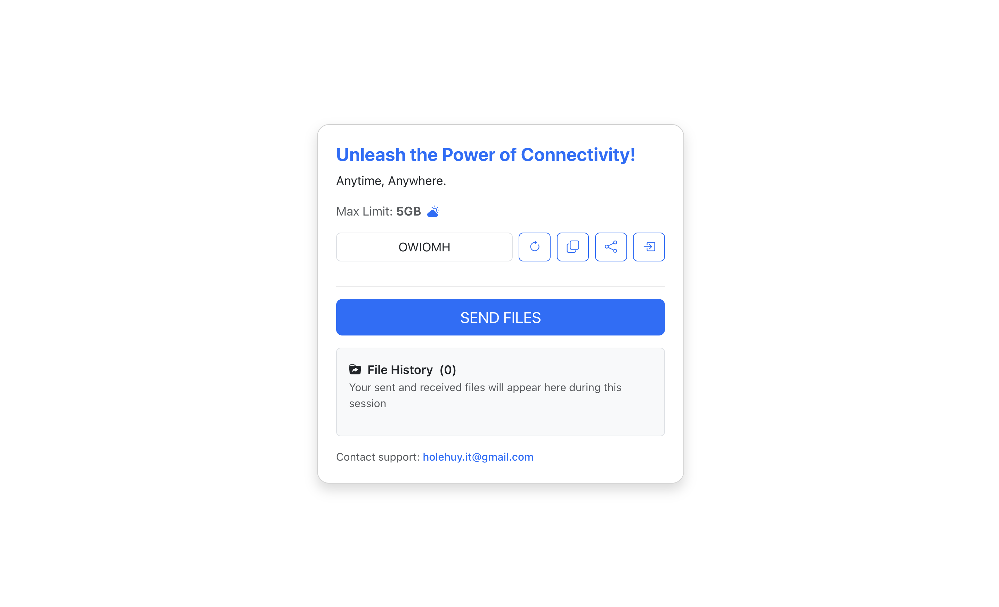

# ThrowFile – Peer-to-Peer File Sharing

ThrowFile is a lightweight, browser-based peer-to-peer file sharing app built with WebRTC and WebSockets. It allows users to instantly share files directly between devices without uploading them to a central server.



## Features

- Real-time P2P file transfer using WebRTC DataChannels
- WebSocket-based signaling (AWS API Gateway + Lambda)
- Secure, temporary channels
- Chunked file transfer with progress tracking
- Accept/Reject flow before receiving files
- Multi-file support
- No file storage on servers

## Tech Stack

- Frontend: React + TypeScript + Vite
- Backend: AWS CDK, API Gateway (WebSocket), Lambda (Python), DynamoDB
- Networking: WebRTC (STUN)

## How It Works

1. User opens the app and gets a unique channel.
2. Another user joins the same channel.
3. Peers exchange signaling data via WebSocket.
4. A direct WebRTC connection is established.
5. Files are transferred directly between browsers.

## Deployment

Deployment

1. Deploy the backend (CDK) first

```bash
export FRONTEND_DOMAIN=<example.com>
export ACM_CERT_ARN=<acm_cert_arn>
cdk deploy
```

2. After deployment, copy the WebSocket URL from CDK output

Look for:

`WebSocketWSS_URL`

3. Create the .env file in the frontend folder

`frontend/.env`

Add this line:

```.env
VITE_WS_URL=<WebSocketWSS_URL>
```

Example:

```.env
VITE_WS_URL=wss://xxxxxxxx.execute-api.region.amazonaws.com/prod
```

4. Run the frontend

```bash
cd frontend
npm install
npm run dev
```

5. Deploy the frontend

```bash
sh ./deploy.sh --profile <your-profile-name>
```

- Infrastructure is managed with AWS CDK
- WebSocket API deployed via API Gateway
- Lambda handles signaling
- DynamoDB stores temporary connections

## Security

- No files are stored on the server
- Connections expire automatically via DynamoDB TTL
- Direct browser-to-browser encrypted transfer

## Useful commands

- `npm run build` compile typescript to js
- `npm run watch` watch for changes and compile
- `npm run test` perform the jest unit tests
- `npx cdk deploy` deploy this stack to your default AWS account/region
- `npx cdk diff` compare deployed stack with current state
- `npx cdk synth` emits the synthesized CloudFormation template

## License

MIT
